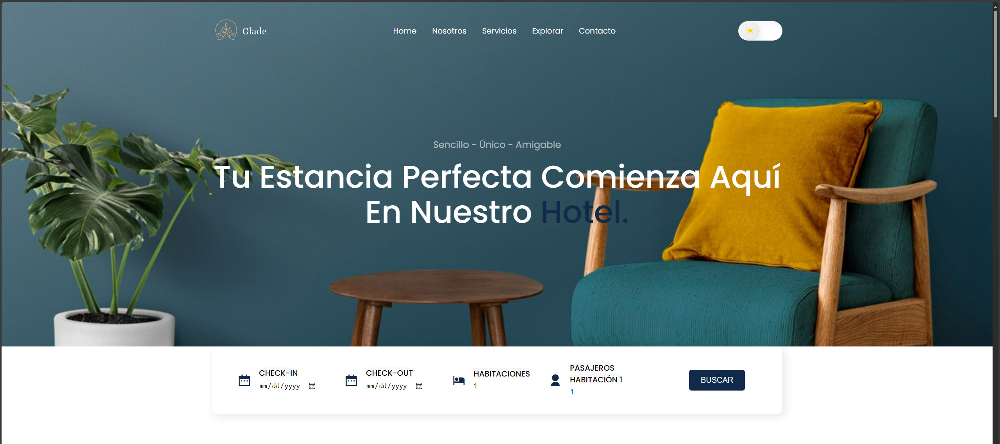
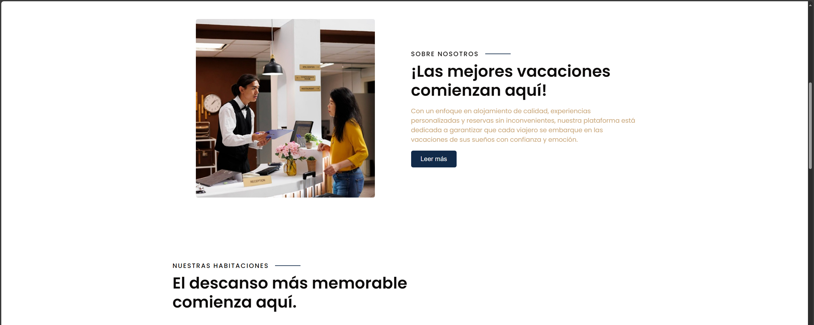
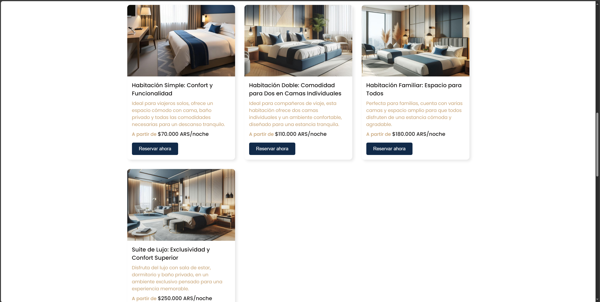
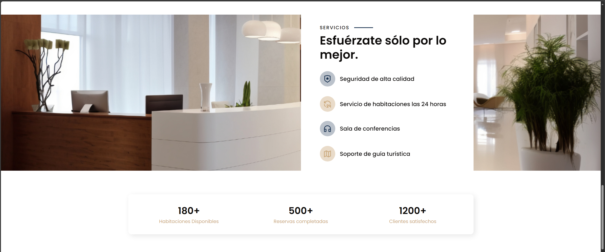
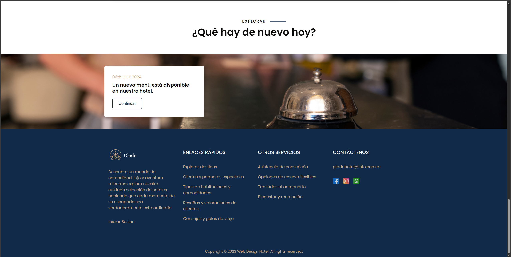
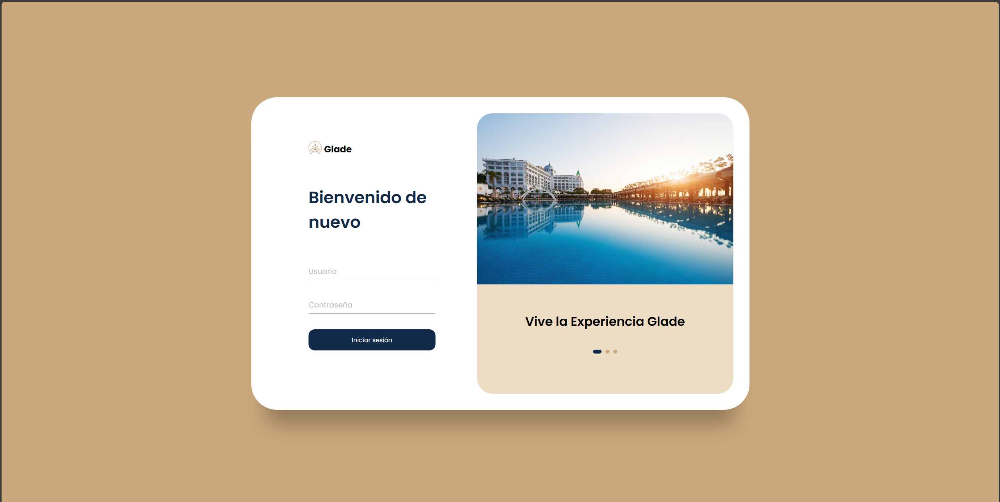
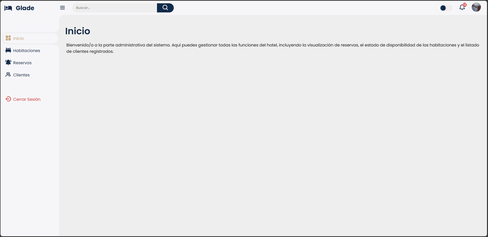
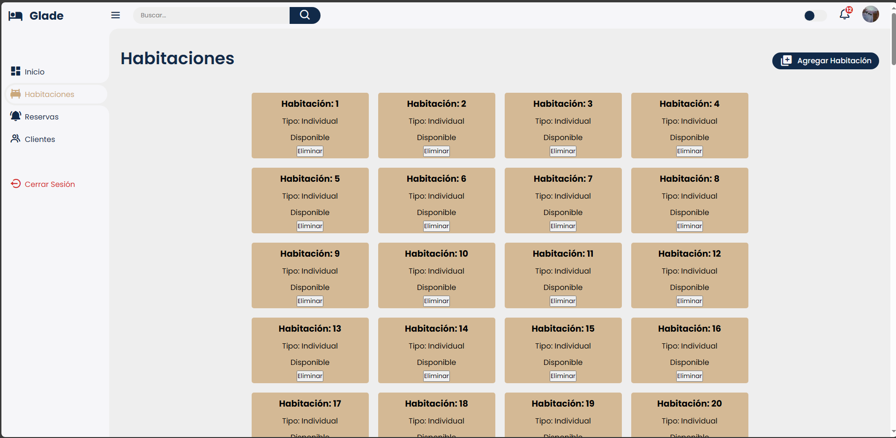
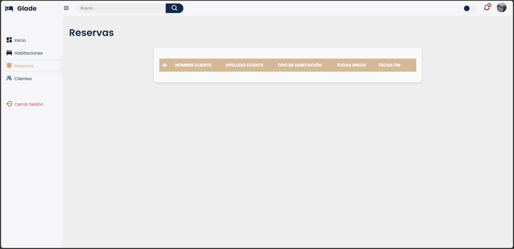
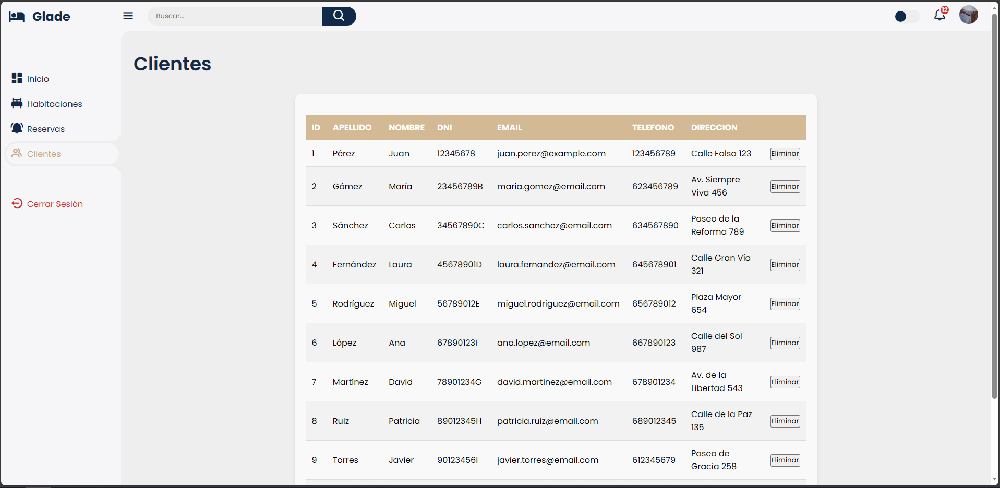

# __Sistema de Gestión Hotelera "Glade"__

## 📋 _Descripción_
Este proyecto es una API diseñada para gestionar las operaciones diarias de un hotel. Permite realizar tareas como:

1. **Reservas:** Crear, modificar y cancelar reservas de habitaciones.
2. **Habitaciones:** Gestionar la disponibilidad de habitaciones, sus características y precios.
3. **Clientes:** Registrar y administrar la información de los clientes.
4. **Facturas:** Generar facturas por las estancias de los clientes.

## 🗂️ _Modelado de Datos (DER)_
El modelo de datos incluye las siguientes entidades:

* Clientes: Información del cliente (ID, nombre, apellido, dirección, etc.)
* Habitaciones: Detalles de las habitaciones (ID, tipo, precio, estado de disponibilidad, etc.)
* Reservas: Información sobre las reservas (ID, ID del cliente, ID de la habitación, fechas de check-in y check-out, estado, etc.)
* Facturas: Detalles de las facturas generadas (ID, ID de la reserva, monto total, fecha de emisión, etc.)

## 🛠️ _Estructura de Clases (OOP)_
Clases Principales
* Cliente:
    * Atributos: id, nombre, apellido, email, telefono, direccion
    * Métodos: registrar(), actualizar(), eliminar()
* Habitacion:
    * Atributos: id, tipo, precio, disponible
    * Métodos: actualizarDisponibilidad(), actualizarPrecio()
* Reserva:
    * Atributos: id, clienteId, habitacionId, fechaInicio, fechaFin, estado
    * Métodos: crear(), modificar(), cancelar()
* Factura:
    * Atributos: id, reservaId, montoTotal, fechaEmision
    * Métodos: generar(), actualizar()

## 🗃️ _Endpoints de la API_
Clientes
* Registrar cliente
    * URL: /api/clientes
    * Método: POST
    * Descripción: Crea un nuevo cliente.
    * Body:
        `{
        "nombre": "Juan",
        "apellido": "Pérez",
        "email": "juan.perez@example.com",
        "telefono": "123456789",
        "direccion": "Calle Falsa 123"
        }`
    * Respuesta exitosa:
        * Codigo: 201 Created
        * Body:   
            `{
            "id": 1,
            "nombre": "Juan",
            "apellido": "Pérez",
            "email": "juan.perez@example.com",
            "telefono": "123456789",
            "direccion": "Calle Falsa 123"
            }`
    * Respuesta error:
        * Código: 400 Bad Request
        * Descripción: Los datos proporcionados en la solicitud son inválidos o incompletos.
        * Body:
            `{
            "error": "Los datos del cliente son incompletos o inválidos.",
            "details": "El campo 'email' es obligatorio."
            }`

* Obtener todos los clientes
    * URL: /api/clientes
    * Método: GET
    * Descripción: Devuelve una lista de todos los clientes.
    * Respuesta exitosa:
        * Codigo: 200 OK
        * Body: 
            `{
                "id": 1,
                "nombre": "Juan",
                "apellido": "Pérez",
                "email": "juan.perez@example.com",
                "telefono": "123456789",
                "direccion": "Calle Falsa 123"
            }`
    * Respuesta error:
        * Código: 500 Internal Server Error
        * Descripción: Error al recuperar los datos de la base de datos.
        * Body:
            `{
            "error": "No se pudo recuperar la lista de clientes.",
            "details": "Error en la base de datos."
            }`

Reservas
* Crear reserva
    * URL: /api/reservas
    * Método: POST
    * Descripción: Crea una nueva reserva de habitación.
    * Body:
        `{
        "clienteId": 1,
        "habitacionId": 2,
        "fechaInicio": "2024-09-15",
        "fechaFin": "2024-09-20"
        }`
    * Respuesta exitosa:
        * Código: 201 Created
        * Body:
            `{
            "id": 1,
            "clienteId": 1,
            "habitacionId": 2,
            "fechaInicio": "2024-09-15",
            "fechaFin": "2024-09-20",
            "estado": "confirmada"
            }`
    * Respuesta error:
        * Código: 400 Bad Request
        * Descripción: Los datos de la reserva son inválidos o la habitación no está disponible.
        * Body:
            `{
            "error": "Datos de la reserva inválidos o habitación no disponible.",
            "details": "La habitación seleccionada ya está reservada para las fechas especificadas."
            }`

Habitaciones
* Obtener todas las habitaciones disponibles
    * URL: /api/habitaciones/disponibles
    * Método: GET
    * Descripción: Devuelve una lista de todas las habitaciones disponibles.
    * Respuesta exitosa:
        * Código: 200 OK
        * Body:
            `{
                "id": 1,
                "tipo": "Simple",
                "precio": 100.0,
                "disponible": true
            }`
    * Respuesta error:
        * Código: 500 Internal Server Error
        * Descripción: Error al recuperar la lista de habitaciones.
        * Body:
            `{
            "error": "No se pudo recuperar la lista de habitaciones disponibles.",
            "details": "Error en la base de datos."
            }`
    
Facturas
* Generar factura
    * URL: /api/facturas
    * Método: POST
    * Descripción: Genera una factura para una reserva específica.
    * Body:
        `{
        "reservaId": 1,
        "montoTotal": 500.0
        }`
    * Respuesta exitosa:
        * Código: 201 Created
        * Body:
            `{
            "id": 1,
            "reservaId": 1,
            "montoTotal": 500.0,
            "fechaEmision": "2024-09-16"
            }`
    * Respuesta error:
        * Código: 400 Bad Request
        * Descripción: Datos inválidos para la generación de la factura.
        * Body:
            `{
            "error": "Datos inválidos para la generación de la factura.",
            "details": "La reserva especificada no existe o el monto total es incorrecto."
            }`

## 🖼️ _Capturas de Pantalla del Progreso_

### 1. Página Principal

### 2. Login para administrador

### 3. Página Principal para administrador

